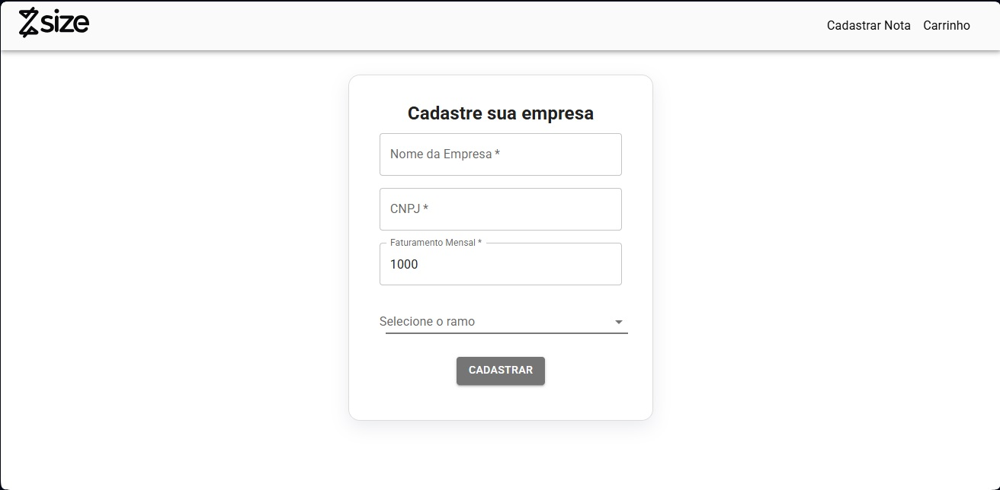
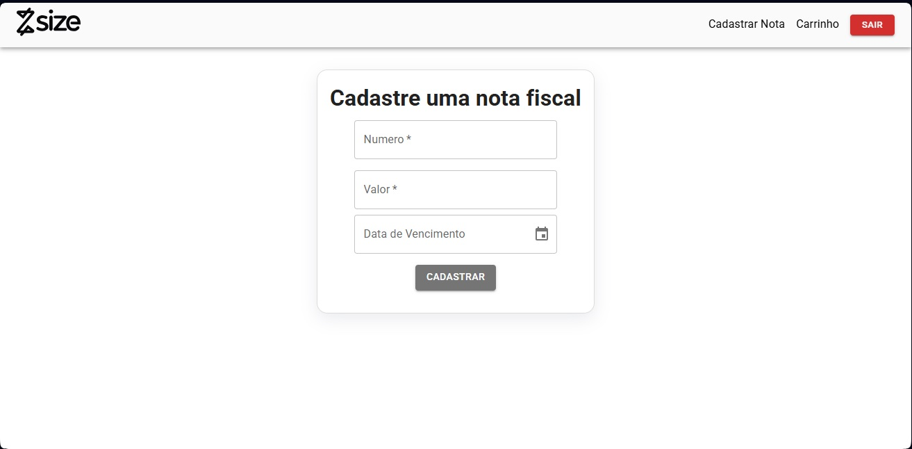
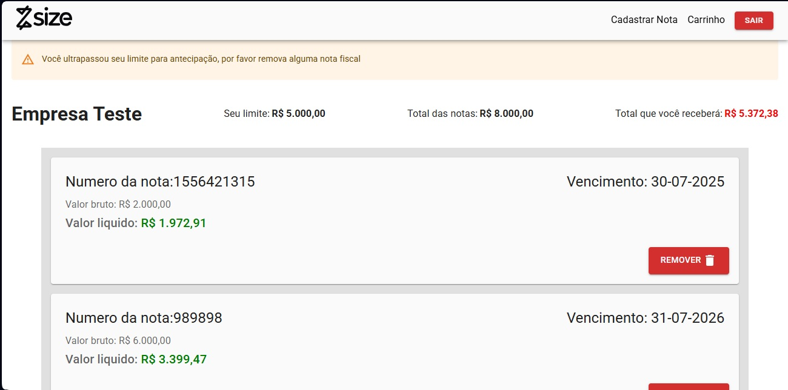
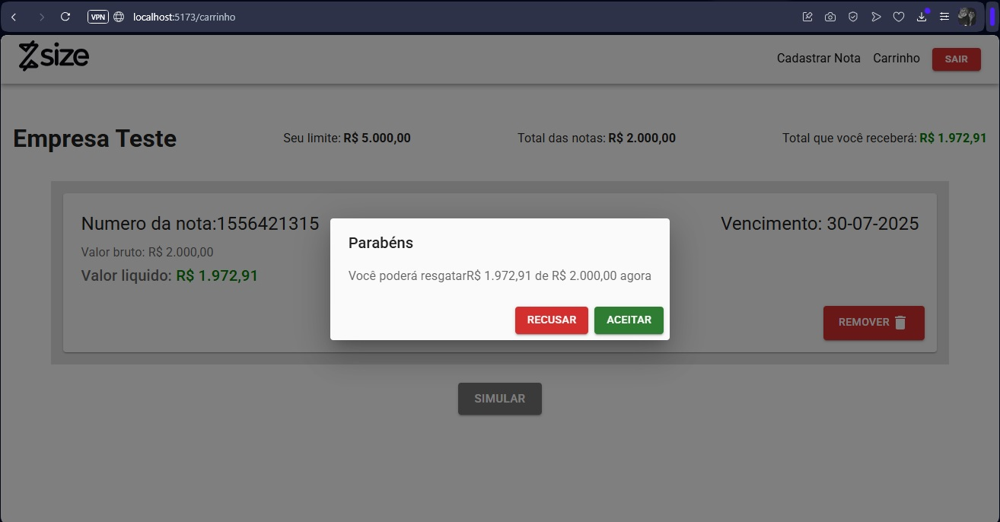
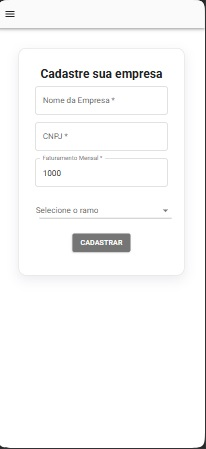
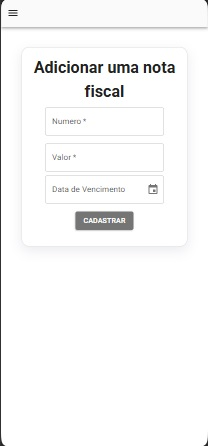
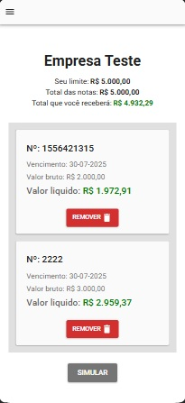
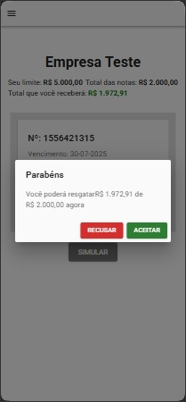

<h1 align="center" style="font-weight: bold;">💻 Desafio Técnico Frontend</h1>

<p align="center">
 <a href="#-sobre-o-projeto">Sobre</a> • 
 <a href="#-tecnologias">Tecnologias</a> • 
 <a href="#-layout">Layout</a> • 
 <a href="#-como-executar">Como Executar</a> •
</p>

---

<h2 id="-sobre-o-projeto">ℹ️ Sobre o Projeto</h2>

Sistema que simula antecipação de crédito para empresas, permitindo que recebam valores de notas fiscais antecipadamente, pagando uma taxa sobre o valor original.

**Principais características:**
- Cadastro de empresas
- Cadastro de notas fiscais
- Simulação de antecipação
- Cálculo automático de taxas
- Interface responsiva

---

<h2 id="-layout">🎨 Layout</h2>

<div align="center">
  <h3>Versão Desktop</h3>
  <h4>Tela de login</h4>
  
  <h4>Tela de cadastro</h4>
  
  <h4>Tela de cadastro de notas fiscais</h4>
  
  <h4>Carrinho</h4>
  
  <h4>Modal final</h4>
  

  <h3>Versão Mobile</h3>
  <h4>Tela login</h4>
  
  <h4>Tela Cadastro</h4>
  
  <h4>Tela cadasto de notas</h4>
  
  <h4>Carrinho</h4>
  
  <h4>Modal final</h4>
  
</div>

---

<h2 id="-tecnologias">🛠 Tecnologias</h2>

**Frontend:**
- ReactJS
- Material UI (MUI)
- Context API

**Backend (Mock):**
- json-server

---

<h2 id="-como-executar">🚀 Como Executar</h2>

### Pré-requisitos
- Node.js (v18+)
- npm ou yarn
- Portas 5000 (backend) e 5173 (frontend) disponíveis

### Instalação
```bash
# Clone o repositório com ssh ou https
git clone https://github.com/marcusmiata/Desafio-Size.git
cd Desafio-Size

# Instale as dependências
npm install
```

### Execução

```bash
#Em 1 terminal
npm run backend
#Em outro terminal
npm run dev
```