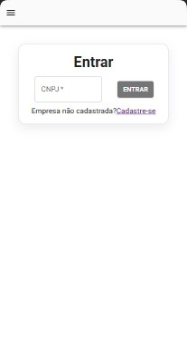
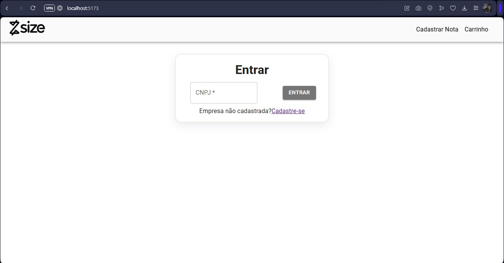

<h1 align="center" style="font-weight: bold;">💻 Desafio Técnico — Frontend (React)</h1>

<p align="center">
 <a href="#tech">Tecnologias</a> • 
 <a href="#started">Inicialização</a> • 
</p>

<p align="center">
    <b> Projeto sobre simulação de antecipação de crédito para uma empresa. Ou seja, se uma empresa recebeu uma nota fiscal, mas o vencimento dela está muito longe, e ela precisa de dinheiro, ela pode pedir para nossa empresa uma antecepação pagando uma taxa em relação ao valor original </b>
</p>

<h2 id="layout">🎨 Layout</h2>

<p align="center">
    
    
</p>

<h2 id="technologies">💻 Tecnologias</h2>

- ReactJS
- json-server
- material UI

<h2 id="started">🚀 Iniciando o projeto</h2>

<h3>Pre-requisitos</h3>

- [NodeJS](https://github.com/)
- [Git 2](https://github.com)

<h3>Iniciando</h3>

As portas 5000 e 5173 serão usadas, então precisam estar disponíveis. 

```bash
cd Desafio
npm run backend
npm run dev
```

